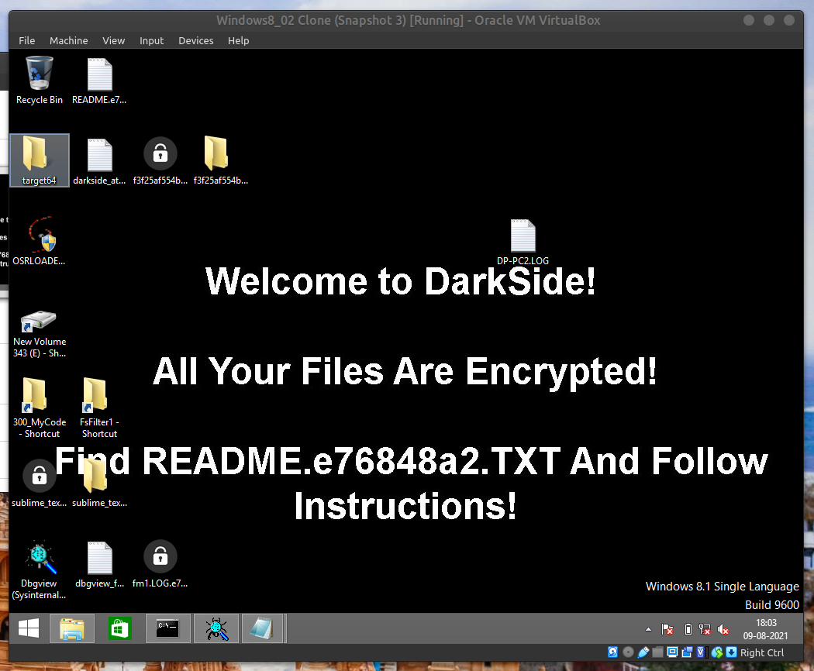
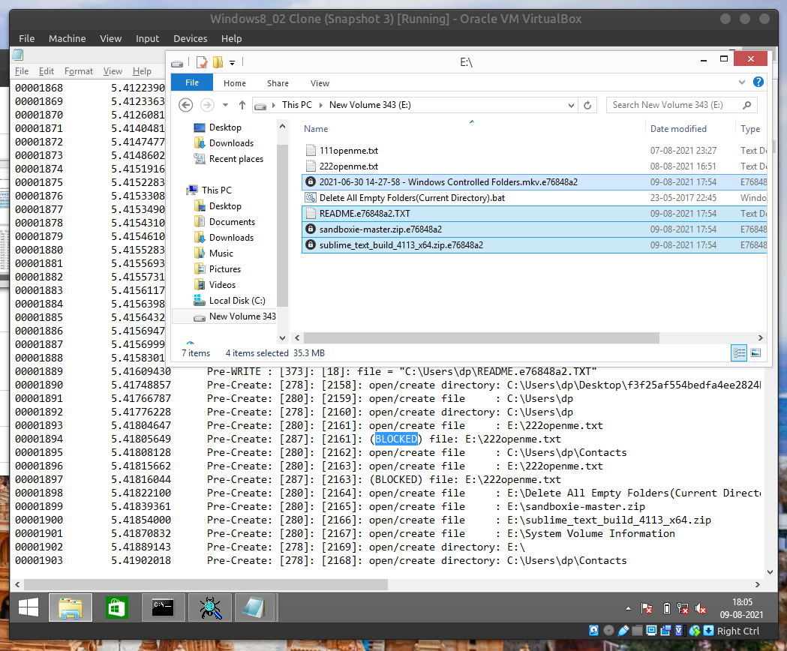

# Windows-Armor

- An AppArmor like filtering module for Windows


### Implementation Details and Limitations
- Rules will be loaded in the `UserMode` and sent to the `KernelMode`
- Limitations of Windows file system auditing
	- https://www.varonis.com/blog/windows-file-system-auditing/
- Delete permission can not be managed using file system filter because of the way in which Windows OS deletes files
	- https://docs.microsoft.com/en-us/samples/microsoft/windows-driver-samples/delete-file-system-minifilter-driver/


### Reading and Testing
- https://googleprojectzero.blogspot.com/2021/01/hunting-for-bugs-in-windows-mini-filter.html
	<!-- REFER: https://stackoverflow.com/questions/20303826/highlight-bash-shell-code-in-markdown-files -->
	```bat
	:: Run the command prompt as administrator
	fltmc
	net start fsfilter1
	net stop fsfilter1
	```


### Images
- Blocked DarkSide Ransomware and protected all files having the string `openme.txt`
	- Commit of repository used: `266678819e2ac5d0b581c74c95397f3f5a440741`
	- Ransomware Sample: [https://bazaar.abuse.ch/sample/f3f25af554bedfa4ee2824bb858280282bd87828d446048619dc49fe061741b4/](https://bazaar.abuse.ch/sample/f3f25af554bedfa4ee2824bb858280282bd87828d446048619dc49fe061741b4/)
		- SHA256 hash: `f3f25af554bedfa4ee2824bb858280282bd87828d446048619dc49fe061741b4`
		- First seen: `2021-06-24 00:15:53 UTC`
	
	


### DISCLAIMER
- Do everything at your own risk. No one will be responsible for anything.

